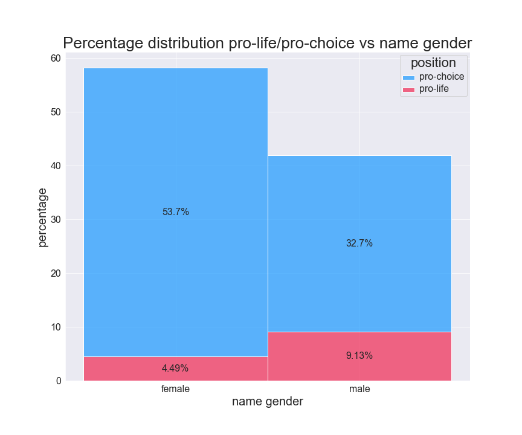

<p align="center">
  <h1>Linkedin Analysis of a Polarizing Post on Abortion (in Portugal)</h1>

  <h3>How to scrape a linkedin post + What we can learn from it.</h3>
</p>

  1. [Contexto (pt)](#contexto-pt)
  2. [Visual Results](#visual-results)
  3. [How to scrape a linkedin post - JavaScript](#how-to-scrape-a-linkedin-post)
  4. [Possible analysis to a polarizing linkedin post - Python](#analysis)


## Contexto (pt)
No dia 28 de junho de 2022, o fundador e ex-ceo da [prozis](https://pt.wikipedia.org/wiki/Prozis#Controv%C3%A9rsias) publicou o seguinte post:

<p align="center">
  

> 'It seems that unborn babies got their rights back in USA! Nature is healing!👍🤌👍'

</p>


As reações aumentaram, a "controvérsia" penetrou outras redes sociais e círculos sociais, até ser notícia em vários media portugueses. Peguei em dois desafios:
1. recolher os comentários e reações dados deste post (ver como [aqui](#how-to-scrape-a-linkedin-post))
2. estudar estes dados para ver como o discurso se polarizou (ver como [aqui](#analysis))

Acontece que o *post foi removido dia 28 à tarde*, e apesar de estar arquivado, o LinkedIn só mostra uma pequena parte da informação se o utilizador não a expandir manualmente. Coincidentemente, eu tinha feita uma recolha dos dados na noite anterior (27/06/2022), portanto ainda que não seja com a totalidade dos dados, analisei como 3106 pessoas reagiram ou comentaram, olhei para o género do seu nome numa tentativa de separação entre visão de género, e para a forma como reagiram ao post inicial para prever a sua visão como pró-vida (pro-life) e pró-escolha (pro-choice). A análise é algo limitada mas a polarização na discussão ficou notória. 

Fica também aqui arquivado o [vídeo-monólogo](media/video-monologo.webm"), caso seja removido como o post foi... (original [aqui](https://www.youtube.com/watch?v=RC6iN8C6LeY))


<details><summary>Ver links partilhados (26)</summary>

```text
https://www.spdc.pt/images/RelatrioIVG2018_Imprensa.pdf.
https://www.pewresearch.org/religion/fact-sheet/public-opinion-on-abortion/
https://www.pewresearch.org/religion/fact-sheet/public-opinion-on-abortion/mulheres
https://www.pewresearch.org/religion/2022/05/06/americas-abortion-quandary/
https://instagram.com/martamelroblackbird?igshid=YmMyMTA2M2Y=
https://expresso.pt/opiniao/2022-06-27-Sou-catolico-o-fim-do-Roe-vs.-Wade-e-um-avanco-da-morte-nao-da-vida-41d86801
https://www.rtp.pt/play/p9874/linha-da-frente
https://www.bbc.com/news/uk-england-merseyside-60714093.amp
https://www.publico.pt/2021/06/22/mundo/noticia/violacoes-graves-criancas-conflitos-sao-assustadoramente-altas-alerta-onu-1967445
https://postimg.cc/LgktFy07
https://www.msdmanuals.com/
https://www.instagram.com/tv/CeuL7R8rjKM/?igshid=YmMyMTA2M2Y=
https://observador.pt/2022/06/24/menina-brasileira-autorizada-a-abortar-apos-polemica-crianca-ficou-gravida-devido-a-violacao/
https://www.who.int/news-room/fact-sheets/detail/abortion
https://www.guttmacher.org/perspectives50/abortion-and-after-legalization
https://www.generonumero.media/portugal-espanha-e-uruguai-o-que-aconteceu-apos-legalizacao-do-aborto/
https://observador.pt/2022/06/24/menina-brasileira-autorizada-a-abortar-apos-polemica-crianca-ficou-gravida-devido-a-violacao/
https://catholicinbelfast.blogspot.com/2018/05/i-was-going-to-be-aborted.htmlEM
https://vounessadirecao.blogspot.com/2020/08/eu-ia-ser-abortado.html
https://www.youtube.com/watch?v=XxYW-B-64Fo
https://observador.pt/2022/06/24/menina-brasileira-autorizada-a-abortar-apos-polemica-crianca-ficou-gravida-devido-a-violacao/
https://observador.pt/2022/06/24/menina-brasileira-autorizada-a-abortar-apos-polemica-crianca-ficou-gravida-devido-a-violacao/
https://www.youtube.com/watch?v=kffacxfA7G4
https://www.linkedin.com/posts/bloco-de-esquerda_em-portugal-a-persegui%C3%A7%C3%A3o-das-mulheres-terminou-activity-6947194675862618113-16nN/
https://www.noticiasaominuto.com/mundo/2017827/bebe-morre-apos-ser-negado-aborto-a-menina-de-12-anos-violada-pelo-avo
https://www.publico.pt/2021/06/22/mundo/noticia/violacoes-graves-criancas-conflitos-sao-assustadoramente-altas-alerta-onu-1967445
```

</details>


## Visual Results

<p align="center">
  <h3>wordcloud of all the replies and comments in the linkedin post</h3>
  <br>
  
</p>

<p align="center">
  <h3>wordcloud of all the replies and comments by miguel milhão</h3>
  <br>
  
</p>

<p align="center">
  <h3>wordcloud of prolife accounts identified based on positive reactions to the original post</h3>
  <br>
  
</p>

<p align="center">
  <h3>Network visualization of user reactions to other users, colored for name gender</h3>
  <br>
  
</p>


* 261/427 aka 61.12% of prolife are male, they are 1194/3106 aka 38.44% of all people
* 161/427 aka 37.70% of prolife are female, they are 1905/3106 aka 61.33% of all people

<p align="center">
  <h3>Network visualization of user reactions to other users, colored for predicted position on abortion</h3>
  <br>
  
</p>



---
EN below

## How to scrape a linkedin post
> Use your browser console to thoroughly scrape a linkedin post

##### Instructions 

1. read these until the end first
2. go to a linkedin post page
3. open the console
4. paste all of the contents of [code.js](code.js)
5. run `await loadAllData();` which will expand all the comments and responses -> might need to run it multiple times
6. run `await getAndDownloadAllData("output.json");` and sitback, it can take several minutes depending on the size of the post, it will put some pressure on your browser + computer, the output.json file will be downloaded when ready

You can also run  `await getAndDownloadAllData("output.json");` before `await loadAllData();` to make sure the download is working as expected for a sample of the data. 

This might happen, advice is to monitor RAM and close all non-essential applications and browser windows:


<p align="center">
  
</p>

---


## Analysis
* Check this twitter thread: 
* The jupyter notebook with the analysis: [analysis.ipynb](analysis.ipynb)

Since the data contains a lot of personal information, and allows to predict the idealogical leaning of those involved, only the [generated graph data](mm-27.gexf) is shared, which is anonymised. 
